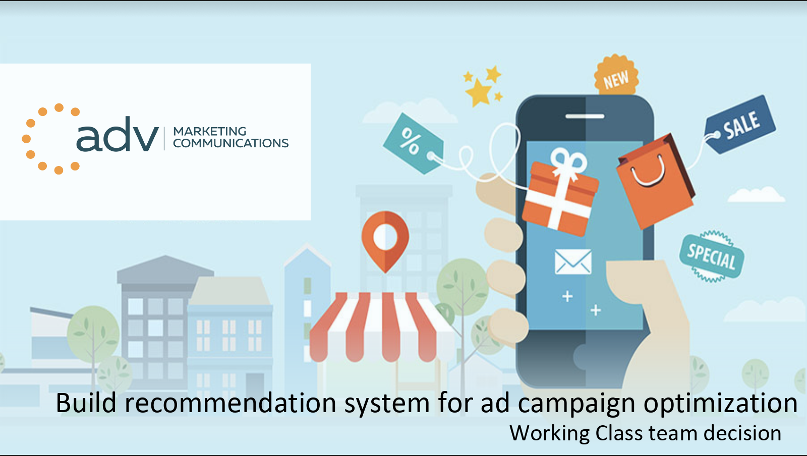
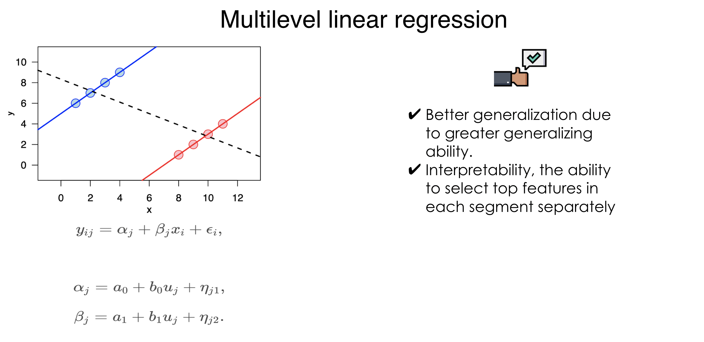
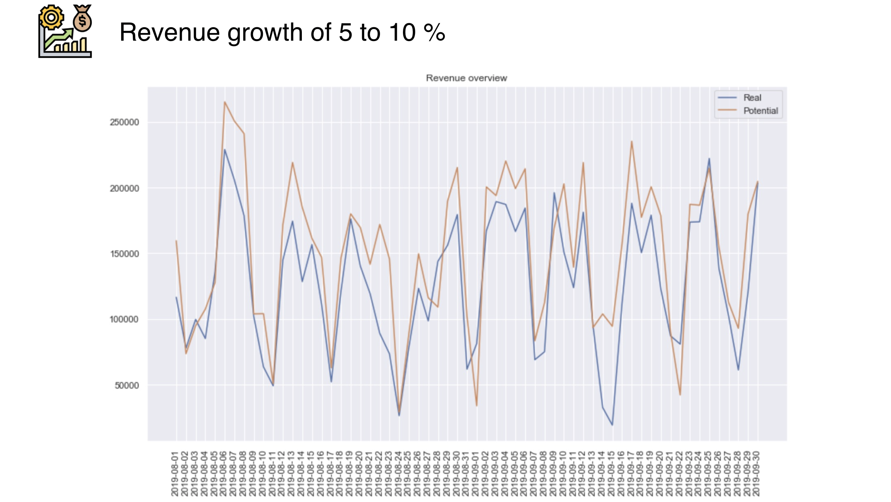

# 1st place solution - Hack.Moscow

Winning solution of LABOUR CLASS team for Hack.Moscow AdTech track. Track was
hosted by [ADV Group](https://advgroup.ru) - one of the largest Digital Media company in Russia.

### Context:
There is a strong demand in optimizing ad campaigns, specially for large
agencies, however large amounts of data are hard to process manually

### Initiatives:
* Research and figure out which parameters are the most significant for business results
* Build a recommendation system for campaigns optimization

### Results:
* Increased average check price and transactions amount
* Increased productivity for marketers
* Service with recommendations for further actions and analytics

### Technical details:
1. Several EDA techniques were performed for data understanding and
Feature Engineering for achieving higher model quality.
2. Multi-level linear model was the best in terms of overall quality,
because there were lots of ad campaigns in different segments
with small amount of data.

More details about model on screen below:

### Potential revenue improvement:

